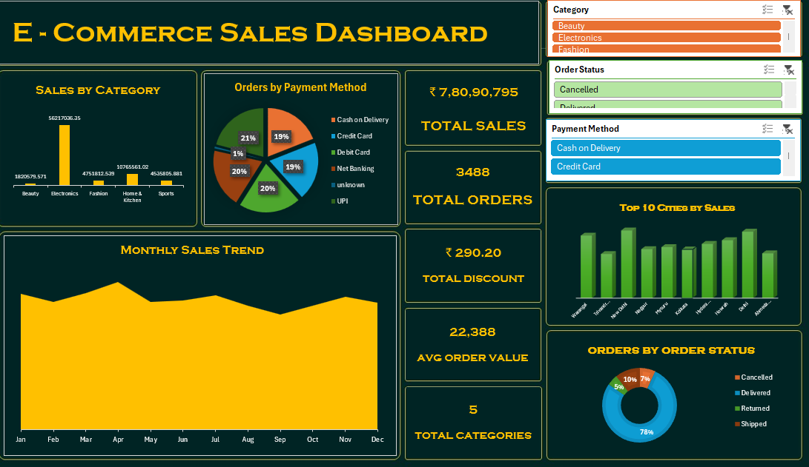

# E-Commerce Sales & Customer Analysis

## Project Overview

This project focuses on analyzing e-commerce sales and customer data to understand sales performance, customer segments, product categories, order trends, payment methods, and order status.

The dataset was cleaned and transformed using Microsoft Excel and Power Query, followed by Pivot Table-based analysis and an interactive dashboard.

## Dataset

The dataset contains **3,488 orders** and includes information such as:

- Order ID
- Order Date
- Order Month
- Customer ID
- Customer Segment
- State
- City
- Category
- Product
- Quantity
- Unit Price
- Discount
- Cost
- Profit
- Payment Method
- Order Status
- Sales Channel
- Sales

## Data Cleaning

The raw dataset was prepared for analysis by:

- Removing duplicate records
- Checking and handling data quality issues
- Standardizing data formats
- Converting required fields into appropriate data types
- Creating the Order Month field
- Validating sales, cost, profit and discount values
- Preparing the cleaned dataset for dashboard analysis

## Tools & Technologies

- Microsoft Excel
- Power Query
- Pivot Tables
- Pivot Charts
- Excel Dashboard
- Data Cleaning
- Data Analysis

## Key Performance Indicators

The dashboard includes the following KPIs:

- Total Sales
- Total Orders
- Total Discount
- Average Order Value
- Total Categories

## Dashboard Analysis

The dashboard provides analysis across multiple business dimensions:

- Sales by Category
- Sales by City
- Monthly Sales Trend
- Order Status Analysis
- Payment Method Analysis
- Customer Segment Analysis
- Product Performance
- Sales Performance

## Key Insights

### 1. Category Performance

Electronics generated the highest sales among the product categories, making it the major contributor to overall revenue.

### 2. Sales Performance

The business generated approximately **78.09 million** in total sales across 3,488 orders.

### 3. Order Performance

The majority of orders were successfully delivered, while a smaller portion of orders were cancelled.

### 4. Monthly Sales

Monthly sales analysis helps identify changes in sales performance throughout the year and supports better business planning.

### 5. Customer & Payment Analysis

Customer segments and payment methods were analyzed to understand purchasing behavior and identify important customer trends.

## Business Recommendations

- Focus on high-performing product categories to improve revenue.
- Analyze cancelled orders to identify possible operational issues.
- Monitor monthly sales trends to plan inventory and marketing activities.
- Identify high-value customer segments and improve customer retention.
- Optimize sales channels and payment options based on customer preferences.

## Project Structure

```text
Ecommerce-Sales-Customer-Analysis
│
├── Dataset
│   └── Ecommerce_Sales_Customer_Cleaned_Analysis.xlsx
│
├── Dashboard
│   └── Ecommerce_Sales_Dashboard.xlsx
│
└── Screenshots
    └── dashboard.png

## Dashboard Preview



## Author

**Ajay Kumar**

GitHub: https://github.com/aju760
